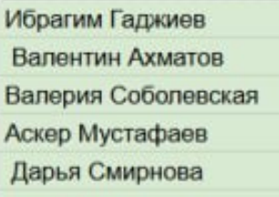

# Домашнее задание 6

**Добавление Swagger-документации и HATEOAS в API.**

- Задокументировать существующее API (из задания 4) с помощью Swagger (Springdoc OpenAPI), чтобы можно было легко изучить и тестировать API через веб-интерфейс.
- Добавить поддержку HATEOAS, чтобы API предоставляло ссылки для навигации по ресурсам.

